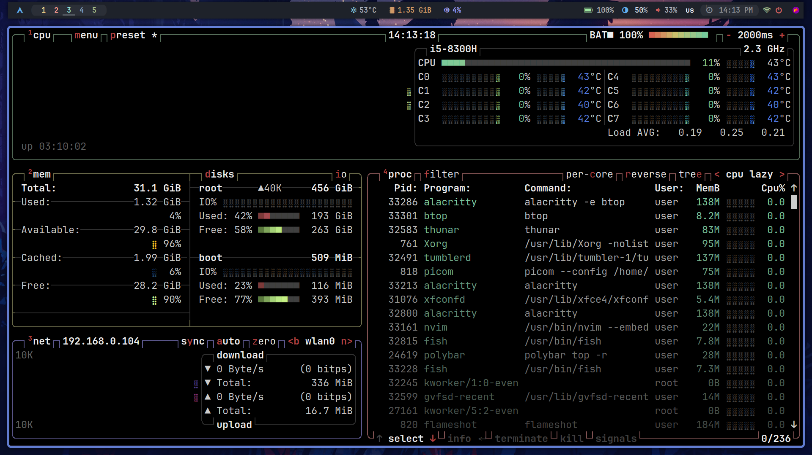
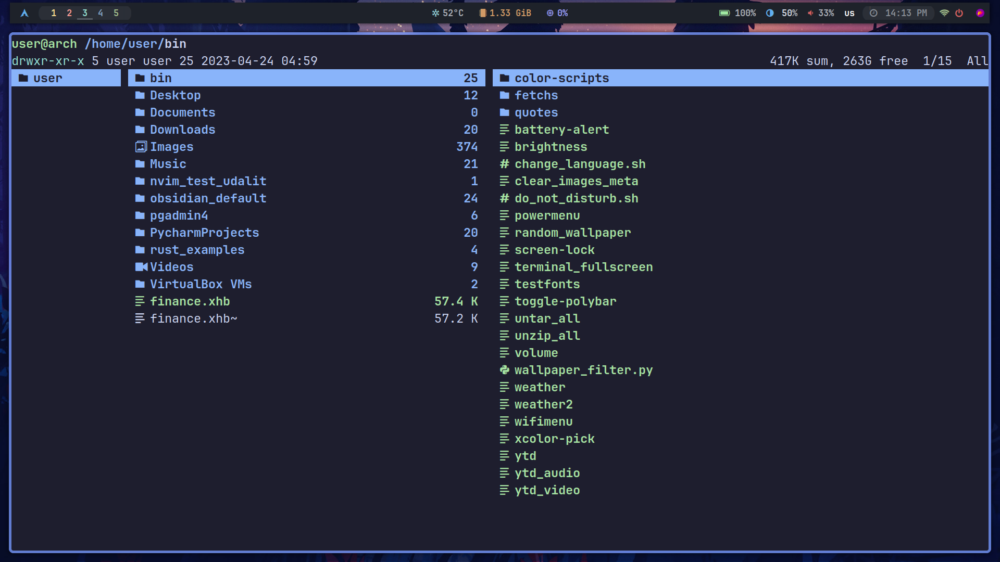
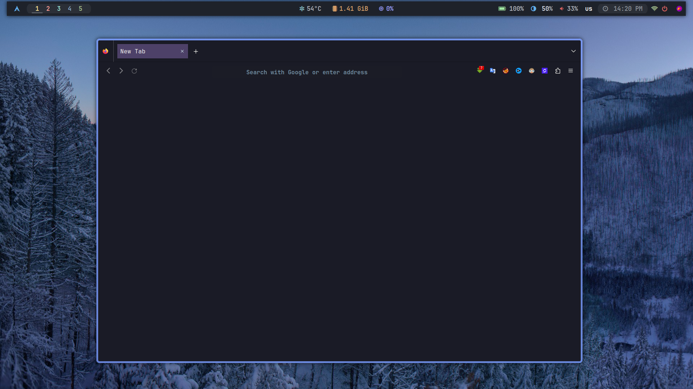
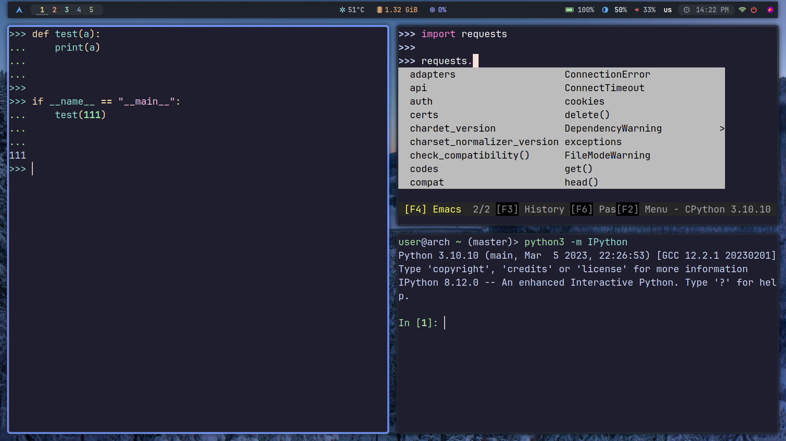

<h1 align="center"> :herb: ZProger Build :herb: </h1>

<!-- BADGES -->


<!-- INFORMATION -->
<h1 align="left"> :herb: about</h1> 


</br>

 - OS: [**`Arch Linux`**](https://archlinux.org/)
 - WM: [**`BSPWM`**](https://github.com/baskerville/bspwm)
 - Bar: [**`Polybar`**](https://github.com/polybar/polybar)
 - Compositor: [**`Picom`**](https://github.com/yshui/picom)
 - Terminal: [**`Alacritty`**](https://github.com/alacritty/alacritty)
 - App Launcher: [**`Rofi`**](https://github.com/davatorium/rofi)
 - Notify Daemon: [**`Dunst`**](https://github.com/dunst-project/dunst)
 - Shell: [**`Fish`**](https://github.com/fish-shell/fish-shell)

</br>


<!-- IMAGES -->
## 🖼️ Gallery









<!-- FEATURES -->
## 🚀 Features
* Customizing software on the system.
* Support for over 300 dynamic wallpapers.
* Lots of handy scripts in bin/.
* Convenient custom configuration of Firefox.
* All hotkeys are honed for maximum productivity.
* A very lightweight system that consumes less than 700mb of memory.
* Automatic installation and configuration of all basic software for development.
**And more...**

<table align="center">
   <tr>
      <th align="center">
         <sup>:warning: WARNING :warning:</sup>
      </th>
   </tr>
   <tr>
      <td align="center">
        THIS CONFIGURATION IS DESIGNED FOR 1920X1080 MONITORS,
        SOME FUNCTIONALITY OF THE SHELL MAY NOT WORK AS IT SHOULD.
        IN THIS CASE YOU NEED TO MAKE ADJUSTMENTS MANUALLY.
        IF YOU FIND ERRORS IN THE SHELL, PLEASE REPORT THE PROBLEM.
   </tr>
   </table>


<!-- INSTALLATION -->
## :blue_book: Installation
* First you need to install Arch Linux without a graphical shell, you can follow [this manual](https://docs.google.com/document/d/1DPSu3DuQ9AJccGPLJgmWFuAi-u1_KsPsqcYHj_Wp870/edit?usp=sharing).
* Install the current build:
```bash
# Install the basic packages
sudo pacman -Sy
sudo pacman -S xorg bspwm sxhkd xorg-xinit xterm git

# Disable any other exec lines and add to the end of the
file with the line: exec bspwm
micro /etc/X11/xinit/xinitrc
```
* Clone the current repository and run the builder: `python3 Builder/install.py`. In the installer menu, select the items you want. The Builder also installs basic development software and useful applications; if you don't need it, you can choose not to install it.
* After installation, type `startx` to start the system


<!-- ERRORS -->
## :moyai: Post-installation fixes
* **The brightness of the screen is not displayed on the bar**. This error is due to the fact that the Builder was unable to automatically install drivers for the video card or processor. You need to go to [Arch Wiki](https://wiki.archlinux.org/) and do the installation manually.
* **The battery is not displayed on the bar**. You need to open `~/bin/battery-alert` and change the `battery` variable to your battery value.
* **Hangs animation or terminals**. The problem is that you may not be using graphics drivers or may be working from a virtual machine. You need to open `~/.config/bspwm/bspwmrc` and comment out the line with the `picom` startup.
* 


<!-- HOTKEYS -->
## 💻 HotKeys
* **Open the terminal** - `super + p`
* **Set a random wallpaper** - `super + w`
* **Switch the layout** - `shift + alt`
* **Open the application menu** - `super + d`
* **Open the browser in incognito mode** - `super + shift + i`
* **Recognize the color on the screen** - `super + shift + x`
* **Lock the screen** - `super + shift + l`
* **Open the console calendar** - `super + shift + k`
* **Launch Telegram** - `super + shift + t`
* **Start displaying quotes on the screen** - `super + shift + q`
* **Close the window that is in focus** - `super + c`
* **Take a screenshot** - `print`
* **Restart bspwm** - `ctrl + shift + r`
* **Switch to another desktop** - `super + 1/6`
* **Move the window to another desktop** - `super + shift + 1/6`
* **Switch the window to floating mode** - `super + space`

The other hotkeys are in ~/.config/sxhkd/sxhkdrc.

#

The project is actively developing, so you can offer your ideas for improvements and visit our [YouTube channel](https://youtube.com/@zproger) and [Telegram](https://t.me/codeblog8)
